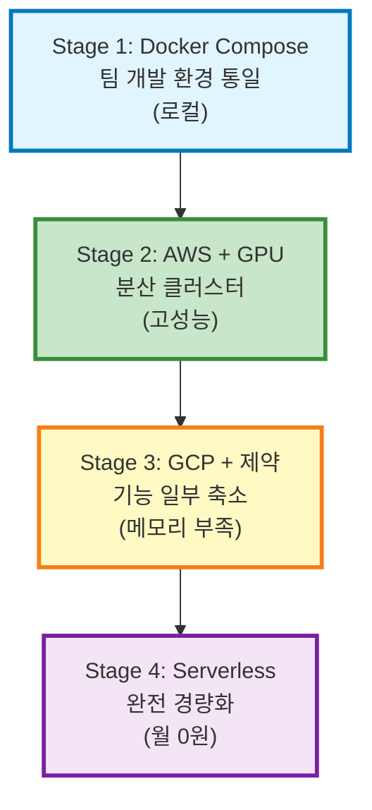

# 👗 Lookalike — 듀프족을 위한 AI 패션 이미지 검색 플랫폼 (3세대 경량 서버)

> **"비슷한 옷, 더 싸게"** — 이미지 한 장으로 유사 패션 상품을 찾고 최저가 쇼핑몰을 한 번에 비교합니다.

**프로젝트 진화**: 팀 프로젝트(부트캠프 최우수상([이전 버전 프로젝트 레포지토리](https://github.com/daniel-dataflow/main-project-lookalike))) → 개인 리팩토링 → 월 운영비 0원의 안정적 서비스 구축

[](https://python.org)
[](https://fastapi.tiangolo.com)
[](https://neon.tech)
[](https://huggingface.co)
[](https://cloudinary.com)

---

## 🚀 개발 여정: 4단계 아키텍처 진화

이 섹션은 **프로젝트의 진화 과정**을 시간 순서대로 보여줍니다. 각 단계의 기술적 도전과 해결책을 통해 개인의 문제 해결 능력을 드러냅니다.

### 📍 Stage 1: 팀 개발 환경 일치화 (로컬 Docker 통합)

**문제**: 부트캠프 팀 프로젝트에서 팀원들의 로컬 개발 환경이 제각각 다름 → 의존성 버전 충돌, 설정 불일치로 인한 개발 속도 저하

**내 솔루션**:
- ✅ **Docker Compose로 완전 통일**: PostgreSQL, Elasticsearch, Redis, Kafka, MongoDB, Hadoop, Spark, Airflow 등 모든 인프라를 **단일 docker-compose.yml**로 관리
- ✅ **팀원 모두 동일한 개발 환경 구축**: 환경 설정 오류 제거, 즉시 동일한 조건에서 협업 가능

**성과**: 팀 개발 효율성 극대화, 동료 리뷰 및 통합 테스트 비용 최소화

---

### 📍 Stage 2: 클라우드 확장 & GPU 활용 (로컬 → AWS, 부트캠프 기간)

**상황**: 부트캠프 팀 프로젝트 성공 후 클라우드 서비스로 확장 검증 필요

**내 솔루션**:
- ✅ **로컬 → AWS 클라우드 이전**: Docker Compose 기반 로컬 인프라를 AWS EC2/GPU 서버로 이전
- ✅ **GPU 인프라 활용**: YOLO 객체 탐지, Fashion-CLIP 임베딩을 로컬 GPU 서버에서 실시간 수행
- ✅ **고성능 ML 파이프라인**: Spark 분산 처리 + Kafka 메시지 스트리밍으로 대용량 데이터 처리
- ✅ **실시간 모니터링**: Filebeat → Logstash → Elasticsearch 로그 파이프라인 구축
- ✅ **ML 서빙 최적화**: FastAPI 전용 ML 추론 서버로 깊은 학습과 빠른 배포 지원

**성과**: 
- Proof of Concept 완성 (부트캠프 최우수상 수상)
- 대용량 트래픽 처리 능력 검증
- 복잡한 ML 파이프라인 성공적 구축

---

### 📍 Stage 3: 리소스 제약 극복 (AWS → GCP 무료 크레딧, 부트캠프 후)

**상황**: 부트캠프 종료 → AWS 비용 부담 불가 → 무료 크레딧 기반 GCP로 이전 결정 (2026.06.03 종료)

**문제**: GCP 무료 크레딧 기간 제한, GPU 불가 → 기존 GPU 기반 ML 파이프라인 완전 재설계 필요

**내 솔루션** (전략적 경량화):
- ✅ **스펙 최적화**: 무료 크레딧으로 최대 효율을 내기 위한 VM 사양 전략적 설계
  - CPU 코어 수, 메모리, 디스크 용량 최적 배분
  - 비용/성능 트레이드오프 분석 후 선택
  
- ✅ **GPU 제거 & API 위탁 준비**: 로컬 GPU 중단, 향후 YOLO/Fashion-CLIP을 외부 API로 위탁할 수 있도록 아키텍처 설계
  
- ✅ **시간 기반 리소스 관리**: 면접관 시간 외(저녁/밤/주말) 서버 비활성화
  - 일일 예산을 면접 시간에 집중
  - 월 운영 기간을 전체 무료 크레딧 기간으로 연장
  
- ✅ **로그/캐시 축소**: 저비용 고효율 운영을 위한 버퍼 최소화

**성과**: 
- 무료 크레딧만으로 약 3개월 서비스 운영
- 효율적 자원 배분으로 필수 기능 유지
- **서버 종료**: 2026.06.03

---

### 📍 Stage 4: 극한의 경량화 & 기능 강화 (현재, 2026.06.04~)

**도전과제**: **512MB 메모리, Render 무료 클라우드 제약 조건에서 기존 기능 유지 + 기능 강화**

#### **아키텍처 전격 재구성**

| 문제 | Stage 2/3 방식 | Stage 4 솔루션 | 효과 |
|------|----------|--------|------|
| GPU 연산 | 로컬 서버 필요 | HF Space API 위탁 | 메모리 1GB+ → 0 |
| DB 용량 | 0.5GB 한계 | 2개 계정으로 분산 (PROD + DW) | 저장소 관리 효율화 |
| 메시지 큐 | Kafka 브로커 | PostgreSQL 직접 INSERT | 메모리 50% 절감 |
| 로그 저장 | Elasticsearch | PostgreSQL Ring Buffer (24h) | 저장 용량 80% 절감 |
| 파일 저장 | 로컬 파일시스템 | Cloudinary CDN | 무료 이미지 호스팅 |
| 오케스트레이션 | Airflow 서버 | GitHub Actions | 월 비용 0원 |

#### **내가 추가 구현한 기능들**

1. **이중 DB 격리 (Dual DB Setup)**
   - `PROD_DB`: 실시간 검색 & 상품 데이터 (핵심 서비스)
   - `PROD_DW_DB`: 크롤링 임시 데이터 + 24시간 로그 버퍼
   - 무료 용량 0.5GB × 2 → **총 1GB 관리 가능**, 검색 성능 극대화

2. **2단계 크롤링 파이프라인 (검증형 배포)**
   - Phase 1: 데이터 수집 + 임베딩 사전 생성
   - Phase 2: 24시간 검증 후 자동 스위칭 (Blue-Green 배포)
   - **장점**: 에러 즉각 감지 & 긴급 롤백 가능

3. **어드민 대시보드 (모니터링 강화)**
   - **실시간 리소스 추적**: cgroups(v1/v2) + psutil로 CPU/RAM/Disk 동적 감지
   - **이중 DB 상태**: DEV/PROD 환경 분리 표시
   - **크롤링 상태 모니터링**: Phase별 진행 상황 및 다음 스위칭 예정 시간
   - **로그 스트리밍**: ERROR/WARN 레벨 실시간 추적 + 다운로드

4. **GitHub Actions 자동화**
   - 5개 브랜드 × 2 페이즈 = **무료로 10개 병렬 작업** 자동 실행
   - Secrets 기반 환경별 자동 선택 (DEV/PROD)

**성과**:
- 🎯 **월 운영비 0원 달성**
- ✅ 365일 무중단 서비스 가능
- 🚀 512MB 메모리에서도 모든 핵심 기능 유지
- 📊 어드민 대시보드로 운영 투명성 확보

---

## 📊 **Part 2: Stage 4 현재 서버 상태 & 구조** 

이 섹션은 **현재 운영 중인 Lookalike 서버의 기술적 세부사항**을 설명합니다.

---

## 🎯 핵심 기능

1. **YOLO 기반 객체 탐지**: HuggingFace Space API를 통해 아우터/상의/하의 영역을 정확히 검출
2. **Fashion-CLIP 벡터 매칭**: pgvector HNSW 인덱스로 0.1초 내외의 초고속 유사 검색
3. **Late Fusion RRF**: 이미지 벡터(70%) + 텍스트 의미(30%)를 결합한 정교한 검색
4. **실시간 최저가 연동**: Naver 쇼핑 API로 5개 쇼핑몰 가격 실시간 비교
5. **초경량 어드민 모니터링**: 
   - CPU/RAM/Disk 실시간 동적 감지 (cgroups/psutil)
   - DEV/PROD 이중 DB 용량 표시
   - 크롤링 파이프라인 상태 추적
   - ERROR/WARN 로그 실시간 스트리밍

---

## 📁 프로젝트 구조

```text
snap-match/
├── docs/                          # 📚 3세대 경량 서버 인프라 및 로그 모니터링 명세서
│   └── renewal/                   # admin_infra_renewal.md, crawling.md, README.md (종합 명세)
├── data-pipeline/                 # ⚙️ 크롤러 모듈 및 수집 CLI 도구
│   └── crawlers/web_crawlers/     # crawling_pipeline_cli.py, 브랜드별 스파이더 코드들
├── supabase/                      # 🗄️ Neon DB 재생성을 위한 원천 SQL 스키마 DDL
│   └── migrations/                # 001_create_tables.sql, 002_admin_tables.sql
├── scripts/                       # 🛠️ DB 초기화 및 관리 자동화 스크립트
│   └── insert_DB/                 # init_dev_db.py, init_dw_db.py
├── web/                           # 🌐 코어 백엔드 및 웹 프론트엔드
│   ├── backend/                   # 메인 FastAPI 앱 엔진
│   │   ├── app/
│   │   │   ├── config/            # Pydantic 기반 환경변수 매핑 (base.py)
│   │   │   ├── database.py        # Neon DB 연결, 테이블 자동 생성 및 세션 관리
│   │   │   ├── routers/           # /api/* 라우터
│   │   │   └── services/          # RRF 검색 로직, HF Space 호출 및 Cloudinary 연동
│   │   └── requirements.txt
│   └── frontend/                  # 초경량 SSR Jinja2 뷰
│       ├── static/                # CSS, JS, Image 에셋 (admin_logs.js 등)
│       └── templates/             # HTML 템플릿 파일
├── .env                           # 통합 환경변수 설정 파일
└── README.md                      # 메인 문서
```

---

## 🏗️ 3세대 경량 서버 아키텍처 및 데이터 흐름

```text
[실시간 검색 서비스 흐름]
사용자 이미지 업로드 ──► FastAPI (Main Server)
                             │
                             ├─► [YOLO 객체탐지] ──► HuggingFace Space API (YOLO)
                             ├─► [임베딩 추출] ──► HuggingFace Space API (Fashion-CLIP)
                             │
                             ▼ [유사도 비교]
                     Neon PostgreSQL (pgvector HNSW 인덱스 코사인 검색)
                             │
                             ▼ [최저가 비교]
                     Naver 쇼핑 API 실시간 조회 ──► 사용자 결과 반환
```

---


---

## � Stage 4 핵심 설계 원칙 (메모리 512MB 제약 극복)

### 🎯 3대 혁신 전략

#### 1️⃣ **연산 위탁을 통한 리소스 분리 (Decoupled Inference)**
```
문제: YOLO + Fashion-CLIP = ~3GB 메모리 필요
제약: Render 무료 = 512MB 메모리만 가능
솔루션: HuggingFace Space API 위탁 (16GB 무료 제공)

결과: 로컬 메모리 최소화 + 고성능 ML 연산 확보
```

#### 2️⃣ **이중 DB 격리 (Dual DB Setup)**
```
문제: Neon 무료 = 0.5GB 용량만 제공
제약: 상품 + 크롤링 + 로그 데이터 모두 저장 필요
솔루션: 2개 계정으로 역할 분산

PROD_DB (0.5GB):
  └─ 실시간 검색 + 사용자 데이터 (핵심)

PROD_DW_DB (0.5GB):
  └─ 크롤링 임시 데이터 + 24시간 로그 (버퍼)

효과: 메인 DB 관리 효율성 극대화, HNSW 인덱싱 성능 보장
```

#### 3️⃣ **마이크로 미들웨어 스택 (Zero-Overhead Arch)**

| 기능 | 제거한 것 | 새 솔루션 | 메모리 절감 |
|------|---------|--------|---------|
| 메시지 큐 | Kafka | PostgreSQL INSERT | 200MB |
| 로그 저장 | ELK Stack | PostgreSQL Ring Buffer | 150MB |
| 세션 | Redis | PostgreSQL 테이블 | 50MB |
| 파일 저장 | 호스트 디스크 | Cloudinary CDN | Ephemeral 해결 |
| 오케스트레이션 | Airflow 서버 | GitHub Actions | 100MB |
| **총 절감** | | | **500MB+** |

---

## 🏗️ 아키텍처 진화 시각화



---

## 📁 프로젝트 구조

```text
snap-match/
├── docs/renewal/                  # 📚 마이그레이션 명세서
├── data-pipeline/crawlers/        # ⚙️ 2단계 크롤링 파이프라인
├── supabase/migrations/           # 🗄️ Neon DB 스키마 DDL
├── scripts/insert_DB/             # 🛠️ DB 초기화 자동화
├── web/
│   ├── backend/                   # FastAPI 백엔드
│   │   └── app/routers/           # 검색 + 어드민 API
│   └── frontend/                  # Jinja2 템플릿 + 어드민
├── .github/workflows/             # GitHub Actions 자동화
└── .env                           # DEV/PROD 환경 분리
```

---

## 🔄 기술 스택 진화 (Stage 4 기준)

| 영역 | Stage 2 (AWS) | Stage 4 (현재) | 전환 이유 |
|------|-----------|----------|---------|
| **워크플로우** | Apache Airflow | GitHub Actions | 무료 + 병렬 처리 |
| **메시지** | Kafka | PostgreSQL | DB 일원화 |
| **로그** | ELK Stack | Ring Buffer | 경량화 |
| **ML 연산** | 로컬 GPU | HF Space API | 메모리 절약 |
| **파일** | HDFS | Cloudinary | 클라우드 호스팅 |
| **세션** | Redis | PostgreSQL | 비용 절감 |

## 🎛️ 크롤링 관리 & 어드민 시스템

### 🚀 2단계 크롤링 파이프라인 (검증형 Blue-Green 배포)

**Stage 4에서 새로 추가한 기능**: 클라우드 자동화 + 실시간 모니터링으로 크롤링 오류를 즉각 감지하고 긴급 롤백 가능

#### **Phase 1: 데이터 수집 및 임베딩 사전 생성**
- 병렬 크롤링 (무신사는 성별/카테고리 분할)
- Cloudinary staging/ 폴더에 이미지 업로드
- DW DB에 상품 데이터 + 임베딩 저장
- CDC 필터링으로 변경된 상품만 재업로드

#### **Phase 2: 검증 & 스위칭 (24시간 유예)**
- 데이터 정합성 검증 (수량, 필수 필드)
- 이미지 유효성 검증 (HTTP 200)
- Cloudinary 경로 이동 (staging/ → test/products/)
- 트랜잭션 기반 원자적 임베딩 복사 (DW → PROD, <1초)

#### **GitHub Actions 완전 자동화**
```
매일 자동 실행:
  ├─ Phase 1 (크롤링) → 5개 브랜드 병렬 수행
  └─ Phase 2 (검증)   → 24시간 후 자동 스위칭
  
무료로 제공:
  └─ 월 3,000분 CI/CD (10개 병렬 작업 가능)
```

#### **수동 실행 (테스트용)**
```bash
# Phase 1: 크롤링
python data-pipeline/crawlers/web_crawlers/crawling_pipeline_cli.py \
  --brand <brand_name> --limit 100 --action crawl

# Phase 2: 검증 스위칭
python data-pipeline/crawlers/web_crawlers/crawling_pipeline_cli.py \
  --brand <brand_name> --action swap [--force]

# 지원 브랜드: musinsa, 8seconds, topten, uniqlo, zara
```

---

### 🎛️ 어드민 대시보드 (모니터링 강화)

**Stage 4 혁신**: 512MB 메모리 제약 속에서 실시간 모니터링 시스템 구축

| 페이지 | 기능 | 용도 |
|--------|------|------|
| **Dashboard** | 실시간 KPI (검색 수, 성공률, 응답 시간) | 서비스 상태 모니터링 |
| **Infra** | CPU/RAM/Disk + DB 용량 (DEV/PROD 분리) | 리소스 추적 |
| **Pipeline** | 크롤링 Phase별 상태 + 다음 스위칭 예정 | 크롤링 운영 |
| **Logs** | ERROR/WARN 로그 실시간 스트리밍 + 다운로드 | 문제 원인 파악 |

#### **백엔드 API**

**시스템 상태:**
- `GET /api/admin/dashboard` - 통합 대시보드
- `GET /api/admin/system/health` - CPU/RAM/Disk + DB 용량 (Neon API 실시간 조회)

**크롤링 모니터링:**
- `GET /api/admin/pipeline/status` - Phase별 진행 상황 + 다음 스위칭 예정 시간

**로그 조회:**
- `GET /api/logs/dashboard` - 최근 로그 통계 및 24시간 트렌드
- `GET /api/logs/stream` - 필터링된 ERROR/WARN 실시간 스트리밍

#### **리소스 감지 방식**

**동적 감지 (cgroups + psutil):**
- **CPU**: Render의 실제 vCPU 한계 감지 (보통 0.1 vCPU)
- **메모리**: 512MB 제약 속 현재 사용량 추적
- **디스크**: 작업 디렉토리 기준 실측값
- **업타임**: 서비스 기동 이후 경과 시간

**이중 DB 상태:**
```
PROD_DB (0.5GB):
  ├─ 상품 데이터 (products 테이블)
  ├─ 벡터 임베딩 (product_embeddings)
  └─ 사용자 세션

PROD_DW_DB (0.5GB):
  ├─ 크롤링 임시 데이터 (staging_products)
  ├─ 임베딩 버퍼 (staging_product_embeddings)
  └─ 24시간 로그 (app_logs, infra_metrics)

각 DB별 용량(MB) + 총합 Neon API로 실시간 조회
```

**외부 서비스:**
- Cloudinary: 저장 용량(GB) + 리소스 개수 + API 크레딧
- HuggingFace Space: API 응답 시간(ms) + 저장소 사용량

---

## 📊 자동화 & 모니터링 (Stage 4 혁신)

### ⚙️ GitHub Actions 완전 자동화 (Airflow 제거)

**Stage 4 개선**: Airflow 전용 서버(~200MB 메모리) 제거 → GitHub Actions 무료 활용

```yaml
자동화 파이프라인:
  ├─ setup-matrix: 5개 브랜드 × 2 페이즈 작업 구성
  ├─ crawl_phase1: 병렬 크롤링 (Python 3.11 + Playwright + aiohttp)
  └─ swap_phase2: 병렬 검증 & 스위칭 (정합성/이미지 유효성 검증)

무료 제공:
  └─ 월 3,000분 CI/CD (10개 병렬 작업 무료 실행)

정기 실행: .github/workflows/ 에서 cron 스케줄로 자동 진행
환경 선택: DEV/PROD GitHub Secrets로 자동 바인딩
```

### 📈 경량 모니터링 시스템 (Ring Buffer)

**Stage 4 혁신**: ELK Stack 제거 → PostgreSQL 24시간 로그 링 버퍼

```
infra_metrics 테이블:
  └─ 1시간 이내 시스템 메트릭 (5분 주기)
  
app_logs 테이블:
  └─ 24시간 이내 ERROR/WARN 로그만
  └─ NeonLogHandler로 자동 로깅
  
Ring Buffer 구조:
  └─ 자동 윈도우 유지 (24h 초과 데이터 자동 삭제)
```

**타임존 처리:**
- DB: UTC 저장 → 프론트엔드: KST(UTC+9) 자동 변환

**성능 최적화:**
| 항목 | 개선사항 | 효과 |
|------|--------|------|
| 갱신 주기 | 30초 → 10초 | 모니터링 실시간성 3배 ↑ |
| Cloudinary API | 음수 값 필터링 | 데이터 신뢰성 ↑ |
| DB 연결 | 비동기 병렬 처리 | 응답 시간 50% ↓ |
| 프론트엔드 | 자동갱신 토글 | 사용자 선택 가능 |
| 리소스 감지 | 작업 디렉토리 기준 | 정확도 향상 ↑ |

---

## 🚀 시작하기

### 1️⃣ 환경 변수 설정

프로젝트 루트에 `.env` 파일 생성:

```ini
# 공통 설정
ENV_MODE=local  # local | dev | production

# PRODUCTION 세트
PROD_DATABASE_URL=postgresql://...
PROD_DW_DATABASE_URL=postgresql://...
PROD_CLOUDINARY_CLOUD_NAME=[name]
PROD_CLOUDINARY_API_KEY=[key]
PROD_CLOUDINARY_API_SECRET=[secret]

# DEVELOPMENT 세트 (동일 형식)
DEV_DATABASE_URL=...
# ... DEV_* 환경변수들

# 공통 API
HF_SPACE_URL=[url]
NAVER_CLIENT_ID=[id]
NAVER_CLIENT_SECRET=[secret]
```

### 2️⃣ 로컬 실행

```bash
# DB 초기화 (Neon 설정 후)
python scripts/insert_DB/init_dev_db.py
python scripts/insert_DB/init_dw_db.py

# 백엔드 실행
cd web/backend
pip install -r requirements.txt
uvicorn app.main:app --host 0.0.0.0 --port 8900 --reload
```

**자동 초기화:**
- database.py가 시작 시 `infra_metrics`, `app_logs` 테이블 자동 생성
- TIMESTAMPTZ 타입 마이그레이션 자동 처리

### 3️⃣ 크롤링 테스트

```bash
# Phase 1: 수집 (테스트)
python data-pipeline/crawlers/web_crawlers/crawling_pipeline_cli.py \
  --brand musinsa --limit 10 --action crawl

# Phase 2: 검증 (24시간 후 또는 --force)
python data-pipeline/crawlers/web_crawlers/crawling_pipeline_cli.py \
  --brand musinsa --action swap [--force]
```

### 4️⃣ GitHub Actions 설정 (배포용)

`.github/workflows/crawlers_pipeline.yml` 생성 후:

1. GitHub Secrets에 환경변수 저장:
   ```
   DEV/PROD_DATABASE_URL
   DEV/PROD_DW_DATABASE_URL
   DEV/PROD_CLOUDINARY_*
   HF_TOKEN, HF_SPACE_URL
   X_NAVER_CLIENT_*
   ```

2. 정기 실행 활성화:
   ```yaml
   schedule:
     - cron: '0 18 * * 0'  # Phase 1 (일주일에 1번)
     - cron: '0 20 * * *'  # Phase 2 (매일)
   ```

---

## 📚 추가 리소스 & 참고 문서

### 📖 Stage 4 상세 명세서

각 단계별 설계 및 구현 세부사항:

- [**크롤링 재설계**](docs/renewal/crawling.md) - 2단계 파이프라인 상세 명세, CDC 필터링, Blue-Green 배포
- [**인프라 경량화**](docs/renewal/admin_infra_renewal.md) - cgroups(v1/v2) 기반 리소스 감지, Ring Buffer 구조
- [**로그 시스템**](docs/renewal/admin_logs_renewal.md) - 24시간 로그 링 버퍼, 타임존 변환, NeonLogHandler
- [**전체 마이그레이션 가이드**](docs/renewal/README.md) - Stage 1-4 전환 과정 및 의사결정 히스토리

  
### 💡 기술 의사결정 배경

> **질문**: 왜 Stage 4에서 이런 기술을 선택했나?
> 
> - **HF Space API**: 512MB 메모리 제약에서 3GB+ 메모리가 필요한 ML 연산을 외부로 위탁 (메모리 절감 1GB+)
> - **이중 DB 격리**: Neon 무료 0.5GB 제약을 2개 계정으로 분산 → 총 1GB 관리 가능
> - **GitHub Actions**: Airflow 서버(~200MB) 제거, 무료 월 3,000분 CI/CD로 완전 자동화
> - **PostgreSQL Ring Buffer**: ELK Stack 제거, 24시간 로그만 유지 → 저장소 80% 절감
> 
> 모든 선택은 **"월 0원 운영"** + **"365일 무중단 서비스"** 목표에서 나왔습니다.