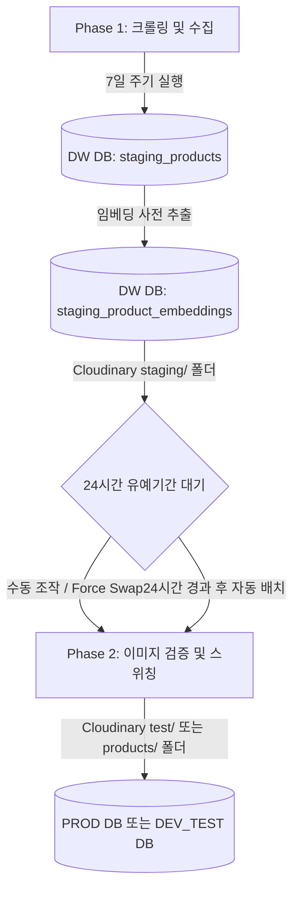

# 크롤링 파이프라인 리뉴얼 및 안전 검증 설계 문서

본 문서는 Lookalike 프로젝트의 크롤링, 스테이징, 이미지 이관(Swap) 파이프라인 리뉴얼 과정과 세부 설계 변경 내용, 그리고 시스템 안정성을 확보하기 위한 **개발 및 테스트 분기 정책**을 기록하는 공식 기술 문서입니다.

---

## 📌 1. 아키텍처 개요 및 배치 프로세스

Lookalike 파이프라인은 크롤링 시점의 서버 부하를 최소화하고, 수집 데이터의 이미지 유효성과 정합성을 사전에 검증하여 무결한 데이터만 운영 DB에 반영하도록 설계되었습니다.



### 1) Phase 1: 7일 주기 수집 및 임시 격리 (DW DB 적재)
* **주기**: 7일마다 1회 작동 (자동 배치 또는 수동 트리거)
* **역할**: 각 브랜드 쇼핑몰에서 상품 상세 및 이미지를 크롤링한 뒤, 실시간으로 Cloudinary 임시 경로(`staging/{brand}`)에 업로드하고 **DW DB**의 `staging_products` 및 `staging_naver_prices` 테이블에 1차 격리 저장합니다.
* **YOLOv11 + Fashion-CLIP 사전 추출**: 수집과 동시에 각 상품 이미지를 YOLOv11 추론 서버(HF Spaces)에 통과시켜 불필요한 배경 노이즈를 제거(Pre-Cropping)한 뒤, 정확도가 극대화된 512차원 Fashion-CLIP 이미지 임베딩과 Gemini 텍스트 임베딩을 백그라운드에서 병렬 생성하여 **DW DB의 `staging_product_embeddings` 테이블**에 사전에 보관합니다.
* **영향**: 이 단계에서는 사용자 화면(운영 DB)에 어떠한 데이터 변화도 주지 않아 크롤링 부하가 상용 서비스에 미치지 않습니다.

### 2) Phase 2: 24시간 검증형 스위칭 (Blue-Green Swap)
* **주기**: 매일 새벽 5시 KST (또는 관리자 대시보드에서 수동 즉시 실행)
* **대상**: 스테이징 테이블에 적재된 지 **24시간이 경과한 데이터** (단, 수동 스위칭 시 `force=True` 옵션을 통해 24시간 미만 데이터도 강제 처리 가능)
* **검증 및 스위칭 절차**:
  1. **정합성 검증**: 수집 데이터의 총 수량 임계치 검사, 이름/카테고리 등 필수 필드의 유실율 검사(5% 이내 허용).
  2. **이미지 유효성 검증**: 비동기 HTTP 요청을 통해 이미지 URL의 활성 상태(HTTP 200 OK)를 딥 스캔.
  3. **Cloudinary 이미지 원격 이동**: 검증 완료 시 Cloudinary 상에서 이미지를 `staging/` ➔ `test/` (또는 `products/`) 폴더로 즉시 이동 처리.
  4. **임베딩 및 데이터 고속 복사**: 실시간 생성의 대기 시간 지연 없이, DW DB의 `staging_product_embeddings`에 기추출되어 보관되어 있던 Fashion-CLIP 이미지 벡터와 Gemini 텍스트 벡터를 고속으로 조회하여 복사합니다.
  5. **트랜잭션 기반 스위칭**: 원자적 트랜잭션을 시작하여 운영 DB(또는 테스트 DB)의 기존 브랜드 상품, 최저가, 임베딩 데이터를 완전히 제거(`DELETE`)하고 신규 데이터를 일괄 적재(`INSERT`)한 뒤 커밋합니다. 실패 시 자동 롤백을 수행하여 이전의 정상 데이터를 유지합니다.

---

## 🛠️ 2. 리팩토링 및 최적화 이력

### 1) 1차 리팩토링 (완료)
* Render 무료 서버 부하 감소를 위해 크롤링 연산을 GitHub Actions 환경으로 완전 이관.
* CLI 엔트리포인트(`crawling_pipeline_cli.py`)와 임시 스테이징 테이블 연동 설계.

### 2) 2차 최적화 (완료)
* **HDFS 의존성 제거**: 레거시 하둡 및 HDFS 연동 모듈을 완전히 도려내고 Neon DB 구조로 일원화.
* **CDC(Change Data Capture) 필터링**: 캐시 데이터를 조회하여 가격 및 이미지에 변경이 없을 경우 Cloudinary 업로드를 생략하여 트래픽 비용 및 시간 단축.
* **2단계 지연 적재 및 유예 시간**: 24시간 검증형 스위칭 모델 수립.

### 3) 3차 물리 이중 분산 DB (PROD DB & DW DB) 표준화 (완료)
* **DB 분리**: 서비스 운영용 `PROD DB`와 수집/로그/시퀀스 보관용 `DW DB` 커넥션 명확히 분리.
* **KST 한국 시간대 통일**: 모든 DB 커넥션 세션 연결 시 `SET TIME ZONE 'Asia/Seoul';`을 강제 주입하여 시간대 동기화. `NOW()` 대신 표준 `CURRENT_TIMESTAMP` 적용.
* **용량 청소**: `staging_` 테이블 및 로그 테이블을 PROD DB에서 영구 Drop하여 무료 플랜 용량(0.5GB) 확보.

### 4) 4차 어드민 스위칭 런타임 오류 해결 (완료)
* **상대 경로 깊이(Depth) 및 절대 경로 수정**: 백엔드 API 서버(`admin.py`)에서 `data-pipeline` 내의 `base_utils`를 로드하기 위한 `sys.path.append`가 실행 위치(cwd)에 상관없이 정상 작동하도록 `os.path.abspath(__file__)` 기준의 절대 경로 산출법으로 전면 수정.
* **누락 패키지 설치**: 백엔드가 실행 중인 가상환경(`ml-env`)에 `base_utils`가 필수 의존하는 `aiohttp` 라이브러리를 동적으로 설치 및 연동 완료.
* **정합성 판별 원복**: 스위칭 대기 조건 시간을 7일(168시간)로 오해하여 잘못 변경했던 부분을 본래의 설계 스펙에 부합하도록 **24시간(`hours_elapsed < 24`)**으로 원복 적용.

### 5) 5차 임베딩 최적화 및 DB 격리 역할 준수 (완료)
* **물리 DB 역할 완전 분리**: 
  * **`DW DB` (수집/격리 전용)**: 오직 크롤러가 사용하는 수집 임시 테이블(`staging_products`, `staging_naver_prices`, `staging_product_embeddings`)과 로그 테이블만 유지하고, 기존에 잘못 혼입되었던 프로덕션용 운영 테이블(`products`, `naver_prices` 등)은 CASCADE로 영구 삭제(DROP)하여 역할을 완전히 물리적으로 격리했습니다.
  * **`TEST DB` (테스트용 운영 DB)**: 실제 운영 DB와 구조가 100% 일치하며, `products`, `naver_prices`, `product_embeddings` 등을 온전히 보유하여 스위칭 연동을 독립적으로 검증합니다.
* **YOLOv11 + Fashion-CLIP 기반 사전 임베딩 추출**:
  * 스위칭 시점에 대량의 임베딩을 실시간으로 구하는 것은 대기 시간 지연과 API 비용 폭탄을 유발합니다.
  * 이에 따라 **Phase 1 (수집)** 단계에서 수집 및 Cloudinary Staging 업로드가 끝난 직후, 각 상품 이미지를 YOLOv11 추론 서버(HF Spaces)에 인입시켜 노이즈가 제거된 핵심 의류 영역만 Crop(Pre-Cropping)한 뒤, 정확도가 극대화된 512차원 Fashion-CLIP 이미지 임베딩과 Gemini 텍스트 임베딩을 백그라운드에서 병렬 생성하여 **`DW DB` 내의 `staging_product_embeddings` 테이블**에 사전 보관하도록 프로세스를 고도화했습니다.
  * **Phase 2 (스위칭)** 시점에는 DW DB에 이미 검증 적재 완료된 고품질 벡터 정보들을 대상 운영/테스트 DB로 단순 쿼리 일괄 복사(INSERT)하여 1초 이내에 초고속 스위칭 트랜잭션이 성공 완료되도록 수정했습니다.

### 6) 6차 환경 변수 공백 제거 및 미사용 레거시 파일 정리 (완료)
* **환경 변수 공백 제거**: `.env` 파일의 `DEV_CLOUDINARY_...` 환경 변수의 등호(`=`) 전후 공백을 제거하여 런타임 환경변수 주입 오류를 완전히 해결했습니다.
* **환경변수 최소화**: 로컬/3세대 아키텍처에 불필요한 MongoDB, Redis, Spark, Hadoop, Airflow 및 GCP 레거시 관련 변수들을 주석(`#`) 처리하여 환경 구성을 직관적으로 가볍게 정돈했습니다.
* **설계 도면(Migrations) 이관**: `scripts/supabase`에 이중 저장되어 혼선을 주던 스키마 DDL 폴더를 삭제하고, 루트의 [supabase/migrations](file:///d:/dev/lookalike-lightweight/supabase/migrations)로 단일화했습니다.
* **임시 스크립트 삭제**: DB 초기화 자동화 스크립트(`init_dev_db.py`, `init_dw_db.py`) 구축을 마친 뒤, 더 이상 쓰이지 않는 루트의 `init_db.py`, 도커 제어용 쉘 파일 6개, `scratch/` 폴더 내 임시 복구 파일 등을 완전히 영구 제거하여 경량 버전에 어울리는 깔끔한 코드를 유지하도록 최적화했습니다.

---

## 🔒 3. 개발 및 테스트 보안 격리 정책 (중요)

> [!IMPORTANT]
> 크롤러 및 어드민 기능이 완벽하게 구성되어 정합성 및 무결성이 100% 검증되기 전까지, 실 서비스용 운영 데이터베이스와 파일 스토리지를 보호하기 위해 **임시 격리 검증 모드**로 동작합니다. 또한 개발(DEV) 환경과 운영(PROD) 환경은 데이터베이스와 클라우드 저장소가 완벽히 2단계로 분할 구성되어 상호 간섭이 존재하지 않습니다. 과도기적인 공유 테스트 환경은 배제하고, 개발 환경(DEV)과 운영 환경(PROD)을 완전히 독립적으로 구축해 배포 안정성을 끌어올렸습니다.

### 1) DEV vs PROD 역할/용량 분담형 멀티 DB 아키텍처
Neon DB의 무료 용량 한계(계정당 0.5GB)를 준수하고 운영 부하를 예방하기 위해 아래와 같이 데이터 쓰임새와 용량에 따라 역할을 분리하여 배치하였습니다.

* **개발/테스트 세트 (`ENV_MODE=local` 또는 `dev`)**:
  - `DEV_DATABASE_URL` (개발용 메인/세션 DB): 듀프 패션 매칭 실시간 검색 서비스에만 집중하여 초고속 인덱스 연산을 보장합니다.
  - `DEV_DW_DATABASE_URL` (개발용 수집/격리 DB): 크롤러가 수집한 대규모 스테이징 원본(`staging_`)과 배치 로그, 임베딩을 보관하여 메인 운영 DB의 스토리지 용량 고갈을 방지합니다.
  - `DEV_TEST_DATABASE_URL` (개발용 스위칭 모의 테스트 DB): 실서버 적재 전, DDL 정합성 및 Blue-Green 이관 검증을 독립적으로 수행하는 샌드박스 DB입니다.
* **운영 세트 (`ENV_MODE=production`)**:
  - `PROD_DATABASE_URL` (상용 서비스 및 사용자 세션 라이브 DB): 순수 매칭 서비스 노출용 products 레코드만 보관합니다.
  - `PROD_DW_DATABASE_URL` (운영 배치를 위한 임시 데이터 격리 및 로그 DB): 수집 데이터를 실 운영망과 분리하여 관리합니다.
  - `PROD_TEST_DATABASE_URL` (운영용 스위칭 안전 검증 격리 DB): 실제 배포 전 최종 검증용 샌드박스 DB입니다.

### 2) Cloudinary 이미지 서버 로컬 및 환경 격리 (최상위 분리)
* 하나의 Cloudinary 공간을 공유하며 발생하던 폴더 오염과 이미지 유실을 예방하기 위해, 최상위 경로를 통해 **개발(DEV) 이미지 저장소**와 **운영(PROD) 이미지 저장소**를 완전 이중화했습니다.
* **DEV 환경**: 이미지 업로드 시 Cloudinary 최상위 폴더가 `DEV/` 하위로 적재됩니다.
  - 임시 적재: `DEV/staging/{brand}/`
  - 검증 이관: `DEV/test/{brand}/` 또는 `DEV/products/{brand}/`
* **PROD 환경**: 이미지 업로드 시 Cloudinary 최상위 폴더가 `PROD/` 하위로 적재됩니다.
  - 임시 적재: `PROD/staging/{brand}/`
  - 검증 이관: `PROD/test/{brand}/` 또는 `PROD/products/{brand}/`
* **적용부**: `base.py`에서 `ENV_MODE`에 따라 `CLOUDINARY_FOLDER` 속성(`DEV` 또는 `PROD`)이 결정되어 크롤링 파이프라인 전역에 환경 격리를 제공합니다.

---

## 💻 4. 로컬 가이드 및 검증 절차

로컬 개발 환경의 터미널에서 아래 명령을 통해 파이프라인의 각 Phase 단계를 재현하고 테스트할 수 있습니다.

### 1) Phase 1: 크롤링 및 임시 격리 적재 (DW DB 적재)
```powershell
# .env 환경 변수 주입 후 파이프라인 스크립트 실행
python data-pipeline/crawlers/web_crawlers/crawling_pipeline_cli.py --brand 8seconds --limit 5 --action crawl
```

### 2) Phase 2: 검증 및 테스트 이관 (TEST DB 이관 및 DW DB 정리)
```powershell
# --force 옵션을 주면 24시간 대기 유예조건을 건너뛰고 즉시 스위칭을 테스트합니다.
python data-pipeline/crawlers/web_crawlers/crawling_pipeline_cli.py --brand 8seconds --action swap --force
```

### 3) 이미지 및 복구 결과 확인
* **DB**: `DEV_TEST_DATABASE_URL`로 지정된 DB의 `products` 및 `naver_prices` 테이블에 해당 브랜드 데이터가 정상 기입되었는지 확인합니다.
* **Cloudinary**: Cloudinary Media Library에 진입하여 `DEV/test/{brand}/` 폴더가 자동 생성되었고, 스위칭된 상품의 이미지 파일들이 해당 영역 내부로 성공적으로 무브(Move) 처리되었는지 확인합니다.
