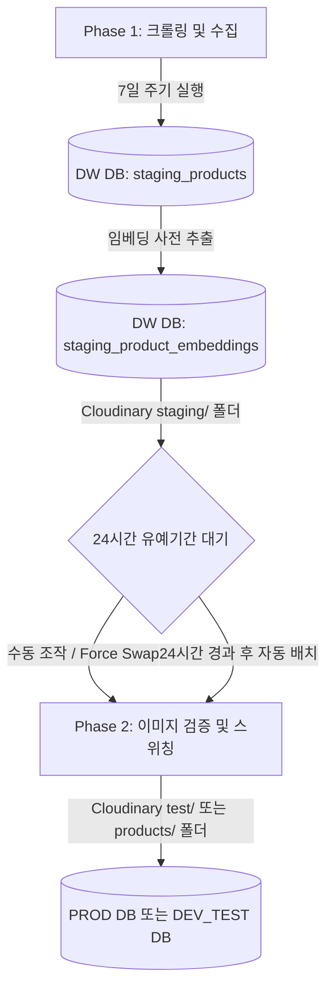

# 크롤링 파이프라인 리뉴얼 및 안전 검증 설계 문서

본 문서는 Lookalike 프로젝트의 크롤링, 스테이징, 이미지 이관(Swap) 파이프라인 리뉴얼 과정과 세부 설계 변경 내용, 그리고 시스템 안정성을 확보하기 위한 **개발 및 테스트 분기 정책**을 기록하는 공식 기술 문서입니다.

---

## 📌 1. 아키텍처 개요 및 배치 프로세스

Lookalike 파이프라인은 크롤링 시점의 서버 부하를 최소화하고, 수집 데이터의 이미지 유효성과 정합성을 사전에 검증하여 무결한 데이터만 운영 DB에 반영하도록 설계되었습니다.



### 1) Phase 1: 7일 주기 수집 및 임시 격리 (DW DB 적재)
* **주기**: 7일마다 1회 작동 (자동 배치 또는 어드민 수동 트리거)
* **역할**: 에잇세컨즈, 탑텐, 유니클로, 스파오, 지오다노, 폴햄 등의 브랜드 쇼핑몰에서 상품 상세 및 이미지를 크롤링한 뒤, 실시간으로 Cloudinary 임시 경로(`staging/{brand}`)에 업로드하고 **DW DB**의 `staging_products` 및 `staging_naver_prices` 테이블에 1차 격리 저장합니다.
* **YOLOv11 + Fashion-CLIP 사전 추출**: 수집과 동시에 각 상품 이미지를 YOLOv11 추론 서버(HF Spaces)에 통과시켜 불필요한 배경 노이즈를 제거(Pre-Cropping)한 뒤, 정확도가 극대화된 512차원 Fashion-CLIP 이미지 임베딩과 텍스트 임베딩을 백그라운드에서 병렬 생성하여 **DW DB의 `staging_product_embeddings` 테이블**에 사전에 보관합니다.
* **영향**: 이 단계에서는 사용자 화면(운영 DB)에 어떠한 데이터 변화도 주지 않아 크롤링 부하가 상용 서비스에 미치지 않습니다.

### 2) Phase 2: 24시간 검증형 스위칭 (Blue-Green Swap)
* **주기**: 매일 새벽 5시 KST (또는 관리자 대시보드에서 수동 즉시 실행)
* **대상**: 스테이징 테이블에 적재된 지 **24시간이 경과한 데이터** (단, 수동 스위칭 시 `force=True` 옵션을 통해 24시간 미만 데이터도 강제 처리 가능)
* **검증 및 스위칭 절차**:
  1. **정합성 검증**: 수집 데이터의 총 수량 임계치 검사, 이름/카테고리 등 필수 필드의 유실율 검사(5% 이내 허용).
  2. **이미지 유효성 검증**: 비동기 HTTP 요청을 통해 이미지 URL의 활성 상태(HTTP 200 OK)를 딥 스캔.
  3. **Cloudinary 이미지 원격 이동**: 검증 완료 시 Cloudinary 상에서 이미지를 `staging/` ➔ `test/` (또는 `products/`) 폴더로 즉시 이동 처리.
  4. **임베딩 및 데이터 고속 복사**: 실시간 생성의 대기 시간 지연 없이, DW DB의 `staging_product_embeddings`에 기추출되어 보관되어 있던 Fashion-CLIP 이미지 벡터와 텍스트 벡터를 고속으로 조회하여 복사합니다.
  5. **트랜잭션 기반 스위칭**: 원자적 트랜잭션을 시작하여 운영 DB(또는 테스트 DB)의 기존 브랜드 상품, 최저가, 임베딩 데이터를 완전히 제거(`DELETE`)하고 신규 데이터를 일괄 적재(`INSERT`)한 뒤 커밋합니다. 실패 시 자동 롤백을 수행하여 이전의 정상 데이터를 유지합니다.

---

## 🛠️ 2. 리팩토링 및 최적화 이력

크롤링 파이프라인의 이력을 순서대로 정렬하여 기록합니다.

### 1) 1차 리팩토링: Actions 기반 수집 분리 (2026-05-24)
* Render 무료 서버 부하 감소를 위해 크롤링 연산을 GitHub Actions 환경으로 완전히 이관하고 분리했습니다.
* CLI 엔트리포인트(`crawling_pipeline_cli.py`)와 임시 스테이징 테이블 연동 설계.

### 2) 2차 최적화: HDFS 의존성 제거 및 수집 캐시(CDC) 도입 (2026-05-28)
* 레거시 하둡(Hadoop) 및 HDFS 연동 모듈을 완전히 도려내고 PostgreSQL Neon DB 구조로 일원화했습니다.
* 캐시 데이터를 조회하여 가격 및 이미지에 변경이 없을 경우 Cloudinary 업로드를 생략하여 트래픽 비용 및 시간 단축.

### 3) 3차 리팩토링: 물리 DB 이중화 및 KST 서울 시간대 통일 (2026-05-30)
* Neon DB의 무료 플랜 용량(0.5GB) 한계를 지키기 위해 메인 `PROD DB`와 `DW DB`로 데이터베이스 커넥션을 물리적으로 완벽히 분리했습니다.
* 모든 DB 커넥션 세션 연결 시 `SET TIME ZONE 'Asia/Seoul';`을 강제 주입하여 시간대를 서울로 동기화했습니다.

### 4) 4차 최적화: 어드민 스위칭 런타임 오류 해결 (2026-06-04)
* 백엔드 API 서버(`admin.py`)에서 `data-pipeline` 내의 `base_utils`를 로드하기 위한 절대 경로 산출법으로 전면 수정했습니다.
* 실행 가상환경(`ml-env`) 상의 누락 패키지(`aiohttp`) 설치를 연동하고, 임시 테스트 스위칭 대기 시간을 설계 스펙인 24시간(`hours_elapsed < 24`)으로 원복 적용했습니다.

### 5) 5차 리팩토링: YOLOv11 + Fashion-CLIP 사전 임베딩 추출 설계 (2026-06-05)
* 수집 시점에 대량의 임베딩을 선 생성하여 **`DW DB` 내의 `staging_product_embeddings` 테이블**에 사전 보관하도록 프로세스를 고도화했습니다.
* 이로 인해 스위칭 시점에는 DW DB에 이미 적재된 벡터들을 대상 운영/테스트 DB로 단순 쿼리 복사(`INSERT`)하여 초고속 스위칭이 가능해졌습니다.

### 6) 6차 최적화: 환경 변수 공백 제거 및 미사용 레거시 파일 정리 (2026-06-08)
* `.env` 파일의 `DEV_CLOUDINARY_...` 환경 변수의 등호 전후 공백을 제거하여 파싱 오류를 해결하고 레거시 변수를 정리했습니다.
* `scripts/supabase`에 이중 저장되어 혼선을 주던 스키마 DDL 폴더를 삭제하고, 루트의 `supabase/migrations`로 합병 단일화했습니다.

### 7) 7차 리팩토링: 모니터 대시보드 리뉴얼 및 긴급 단일 재수집 (2026-06-16)
* 자동 크롤링 모니터링 탭을 읽기 전용 대시보드로 개편하고, 실시간 스캔 결과 총량 대비 수집 현황 게이지바를 연동했습니다.
* 에러 로그 클릭 시 예외 원인을 표시하는 '에러 정밀 진단 모달'을 추가하고, 실패한 특정 상품 1건만 단독으로 타겟팅하여 가상환경(`ml-env`)에서 즉각 백그라운드로 수집을 재수도하는 연동 기능을 탑재했습니다.

### 8) 8차 최적화: 스파오 수집 실패 해결 및 임베딩 3중 안전망 구축 (2026-06-24)
* **스파오(SPAO) 상세 수집 리다이렉트 해결**: 상세 페이지 URL 구성 시 `itemNo`뿐만 아니라 `lowerVendNo`를 함께 추출하도록 크롤러 파싱 로직을 고도화하여 리다이렉트로 인한 수집 스킵 버그를 제거했습니다.
* **네트워크 3중 재시도 로직**: 이미지 다운로드 3회 재시도 및 Gradio API 2회 호출 재시도를 구현하여 에러율을 최소화했습니다.
* **로컬 CLIP 모델 이미지 임베딩 폴백(Fallback)**: API 서버 장애나 YOLOv11 크롭 실패 시 `image_vector`가 `NULL`로 수집되는 현상을 막기 위해, 실패 발생 시 자동으로 로컬 캐시 모델(`openai/clip-vit-base-patch32`)을 가동하여 **원본 이미지 전체에 대해 로컬에서 직접 512차원 임베딩을 생성**해 적재하는 자동 방어막을 구축했습니다.

---

## 🔒 3. 개발 및 테스트 보안 격리 정책

### 1) DEV vs PROD 역할/용량 분담형 멀티 DB 아키텍처
* **개발/테스트 세트 (`APP_ENV=local` 또는 `dev`)**:
  - `DEV_DATABASE_URL` (개발용 메인/세션 DB): 듀프 패션 매칭 실시간 검색 서비스에만 집중하여 초고속 인덱스 연산을 보장합니다.
  - `DEV_DW_DATABASE_URL` (개발용 수집/격리 DB): 크롤러가 수집한 대규모 스테이징 원본(`staging_`)과 배치 로그, 임베딩을 보관하여 메인 운영 DB의 스토리지 용량 고갈을 방지합니다.
  - `DEV_TEST_DATABASE_URL` (개발용 스위칭 모의 테스트 DB): 실서버 적재 전, DDL 정합성 및 Blue-Green 이관 검증을 독립적으로 수행하는 샌드박스 DB입니다.
* **운영 세트 (`APP_ENV=prod`)**:
  - `PROD_DATABASE_URL` (상용 서비스 및 사용자 세션 라이브 DB): 순수 매칭 서비스 노출용 products 레코드만 보관합니다.
  - `PROD_DW_DATABASE_URL` (운영 배치를 위한 임시 데이터 격리 및 로그 DB): 수집 데이터를 실 운영망과 분리하여 관리합니다.
  - `PROD_TEST_DATABASE_URL` (운영용 스위칭 안전 검증 격리 DB): 실제 배포 전 최종 검증용 샌드박스 DB입니다.

### 2) Cloudinary 이미지 서버 로컬 및 환경 격리 (최상위 분리)
* 하나의 Cloudinary 공간을 공유하며 발생하던 폴더 오염과 이미지 유실을 예방하기 위해, 최상위 경로를 통해 **개발(DEV) 이미지 저장소**와 **운영(PROD) 이미지 저장소**를 완전 이중화했습니다.
* **DEV 환경**: 이미지 업로드 시 Cloudinary 최상위 폴더가 `DEV/` 하위로 적재됩니다.
  - 임시 적재: `DEV/staging/{brand}/`
  - 검증 이관: `DEV/test/{brand}/` 또는 `DEV/products/{brand}/`
* **PROD 환경**: 이미지 업로드 시 Cloudinary 최상위 폴더가 `PROD/` 하위로 적재됩니다.
  - 임시 적재: `PROD/staging/{brand}/`
  - 검증 이관: `PROD/test/{brand}/` 또는 `PROD/products/{brand}/`
* **적용부**: `base.py`에서 `APP_ENV`에 따라 `CLOUDINARY_FOLDER` 속성(`DEV` 또는 `PROD`)이 결정되어 크롤링 파이프라인 전역에 환경 격리를 제공합니다.

---

## 💻 4. 로컬 가이드 및 검증 절차

로컬 개발 환경의 터미널에서 아래 명령을 통해 파이프라인의 각 Phase 단계를 재현하고 테스트할 수 있습니다.

### 1) Phase 1: 크롤링 및 임시 격리 적재 (DW DB 적재)
```powershell
# .env 환경 변수 주입 후 파이프라인 스크립트 실행
python data-pipeline/crawlers/web_crawlers/crawling_pipeline_cli.py --brand spao --limit 5 --action crawl
```

### 2) Phase 2: 검증 및 테스트 이관 (TEST DB 이관 및 DW DB 정리)
```powershell
# --force 옵션을 주면 24시간 대기 유예조건을 건너뛰고 즉시 스위칭을 테스트합니다.
python data-pipeline/crawlers/web_crawlers/crawling_pipeline_cli.py --brand spao --action swap --force
```

### 3) 이미지 및 복구 결과 확인
* **DB**: `DEV_TEST_DATABASE_URL`로 지정된 DB의 `products` 및 `naver_prices` 테이블에 해당 브랜드 데이터가 정상 기입되었는지 확인합니다.
* **Cloudinary**: Cloudinary Media Library에 진입하여 `DEV/test/{brand}/` 폴더가 자동 생성되었고, 스위칭된 상품의 이미지 파일들이 해당 영역 내부로 성공적으로 무브(Move) 처리되었는지 확인합니다.
